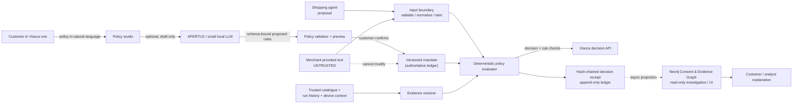
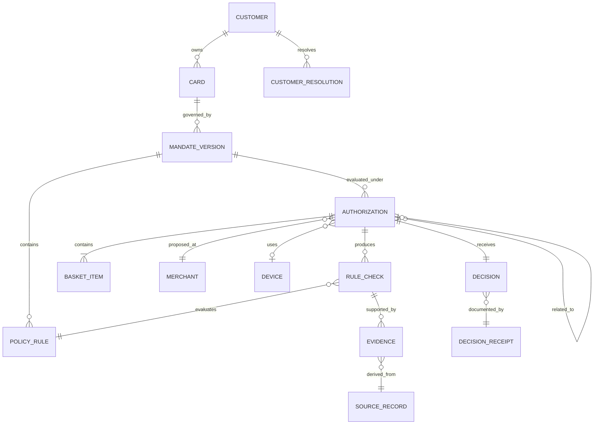

# Trustworthy Graph-Control Layer for “Agent on a Leash”

**Research date:** 19 September 2026<br>
**Recommendation:** build a **Consent & Evidence Graph** backed by a deterministic policy engine. Do **not** make a graph neural network (GNN), GraphRAG system, or language model the payment authorizer.

## Executive answer

The strongest differentiator for this challenge is not “AI that decides whether a payment is safe.” It is a system that can prove, quickly and replayably, **why an independently confirmed customer policy allowed, blocked, or paused a purchase**.

I recommend naming the concept **MandateGraph** (or **ProofGraph**): a versioned graph of customer consent, transaction facts, trusted sources, uncertainty, and final decisions. A small deterministic evaluator reads the confirmed policy and returns `approve`, `decline`, or `step_up`; the graph supplies relationship evidence and produces a human-readable decision receipt. This yields a much more credible fintech proposition than an opaque risk score:

> **Every approval is backed by a proof. Every unknown is visible. No model can silently expand what the customer allowed.**

Use a language model, potentially APERTUS, only to turn the customer's natural-language policy into a **draft** and to phrase explanations. Validate its structured output, show it to the customer, and require explicit confirmation before it becomes executable. The live authorization path must still work—with a conservative, deterministic outcome—if the model, graph service, or any external service is unavailable.

This recommendation directly fits the brief: the wallet control layer must be independent of the shopping agent, keep the customer in control, meet an eight-second default decision deadline, expose its evidence, and treat merchant text as untrusted ([challenge brief](viseca-2026/challenge.md#objective); [technical details](viseca-2026/technical_details.md#6-prepare-your-worker-then-start-a-run)).

## The decision: graph **of evidence**, not a graph model **of authority**

| Approach | Value here | Why it should or should not decide payments |
| --- | --- | --- |
| **Consent & Evidence Graph + deterministic rules** | High. It represents the exact relationships that matter: a policy version governs a card; an authorization contains a basket; a trusted catalogue identifies a merchant; earlier final decisions affect a rolling budget. | **Recommended authorizer.** The outcome is reproducible, bounded, explainable, and can fail safely. |
| **Graph queries / graph-derived features** | High. They reveal familiar merchants/devices, duplicate orders, lookalike merchants, session changes, and prior customer resolutions. | Use as named evidence or escalation signals; do not turn an unexplained aggregate score into a veto. |
| **GNN / learned fraud score** | Low for this prototype. The supplied history gives context, not a labelled definition of fraud or the expected action. | **Do not use as a binding decision-maker.** It would be difficult to validate, explain, and calibrate from this data. |
| **GraphRAG** | Medium for an analyst view or customer explanation. | Never give retrieved prose authority over the confirmed mandate; it increases prompt-injection and latency risk in the hot path. |
| **LLM such as APERTUS** | Medium-high for multilingual policy drafting and customer wording. | Optional, off the money-moving path, schema-bounded, and reviewed by the customer. |

This distinction matters. The data pack explicitly says historical authorization status is neither a fraud label nor an expected decision, and public scenarios contain no answer key ([data guide](viseca-2026/data/data_dictionary.md#what-the-status-column-is); [metadata](viseca-2026/data/metadata.json)). Training a model to reproduce past issuer outcomes would answer the wrong question and could encode historical behaviour instead of customer intent.

## Why this adds real value to the challenge

| Challenge need | MandateGraph capability | What judges can see |
| --- | --- | --- |
| Customer owns permissions | Versioned, customer-confirmed `Mandate` and `Rule` nodes; every decision points to the exact policy snapshot. | “This monitor purchase was checked against version 3 of *your* policy, confirmed at 10:02.” |
| Agent and merchant must not control payment | A one-way trust boundary: shopping-agent proposals and merchant text may provide facts, but cannot create, edit, disable, or reinterpret a policy. | A malicious `item_details` instruction is visually marked **untrusted** and has no path to change a rule. |
| Rules span connected context | Typed paths connect card → approved history → merchant/device; authorization → basket → item/category; run → final decisions → rolling spend. | A compact path shows why a shop is familiar, why a re-quote is related, or why a budget is exhausted. |
| Explain `approve` / `decline` / `step_up` | The evaluator writes one `RuleCheck` per relevant policy rule plus source facts and precedence. | A decision receipt says what passed, failed, or was unknown—not a generic “AI risk score.” |
| Correct temporal state | Final approvals, not pending step-ups, update the spend projection; retries are idempotent. | A budget counter and audit timeline agree even after duplicate delivery or human resolution. |
| Fast and resilient | Local deterministic rules and a small hot context are the critical path; Neo4j and an LLM are optional enrichments. | A graceful fallback that continues local evaluation or follows the configured uncertainty policy rather than timing out. |

The existing repository already validates the premise. `live_layer/guardian.py` has a pure, explainable core for spend cap, merchant familiarity, and velocity checks; its output contains individual checks and evidence. The graph layer currently exists only as an unwired Neo4j container ([guardian](live_layer/guardian.py#L62-L137); [KG status](kg_layer/README.md#L1-L8)). The proposal extends the good deterministic base rather than replacing it with a black box.

## Proposed architecture



### Trust boundaries

1. **Only the customer-confirmed policy grants authority.** The agent, merchant, model, and graph never grant it.
2. **Structured platform facts and catalogue facts are distinguished from merchant claims.** Each fact carries source, timestamp, confidence/availability, and a `trust_tier`; untrusted text cannot become a policy instruction.
3. **A model proposes; code validates; a customer confirms.** A model may neither submit a mandate nor return a binding payment result.
4. **The evaluator is total and deterministic.** Same policy snapshot + normalized request + final-state snapshot = same decision, reason codes, and receipt hash.
5. **An unavailable dependency never becomes implicit permission.** If a mandatory fact is unavailable, apply the policy's configured uncertainty outcome (typically `step_up`; `decline` when the customer chose it).

This is consistent with the challenge's explicit treatment of shop text as untrusted data, not instructions ([technical details](viseca-2026/technical_details.md#2-understand-what-the-customer-allows)). It also responds to NIST's warning that indirect prompt injection can enter through data retrieved by an LLM-integrated application ([NIST AI RMF Generative AI Profile](https://doi.org/10.6028/NIST.AI.600-1)).

## The minimal ontology

Use opaque IDs from the data pack as keys. Never join by person, merchant, or item name; this is especially important because the catalogue includes deliberately similar merchant names (`PixelHarbor` and `PixelHarbour`).



### Node and edge contract

| Object | Essential properties | Key relations | Why it exists |
| --- | --- | --- | --- |
| `MandateVersion` | `mandate_id`, `version`, policy JSON/hash, state, confirmed timestamp, uncertainty mode | `CONTAINS_RULE`, `GOVERNS` | Stops a later explanation from accidentally using today's policy for yesterday's decision. |
| `PolicyRule` | canonical field, operator, value, scope, period, human wording | `EVALUATED_BY` | Makes a policy readable and independently executable. |
| `Authorization` | live ID, request hash, simulated timestamp, amount in integer cents, currency, status | `AT_MERCHANT`, `CONTAINS`, `USES_DEVICE`, `RELATED_TO` | Represents one proposed purchase and allows idempotent replay. |
| `Evidence` | fact name/value, source, trust tier, freshness, extraction status, evidence hash | `DERIVED_FROM`, `SUPPORTS` | Separates a proven fact from a claim, model extraction, or missing datum. |
| `RuleCheck` | outcome `pass` / `fail` / `review`, reason code, comparator input, rule version | `EVALUATES`, `SUPPORTED_BY` | Is the atomic unit of an explanation. |
| `Decision` | outcome, precedence, engine version/hash, finality, deadline result | `DOCUMENTED_BY` | Captures exactly why and how the result was formed. |
| `DecisionReceipt` | policy hash, request hash, check hashes, previous receipt hash, created time | `WAS_GENERATED_BY` | Enables tamper-evident audit and deterministic replay. |

Adopt a small subset of [W3C PROV-O](https://www.w3.org/TR/prov-o/) vocabulary for provenance (`Entity`, `Activity`, `Agent`, `wasDerivedFrom`, `wasGeneratedBy`, `wasAttributedTo`) rather than inventing incompatible audit semantics. It is a lightweight standard intended to represent and exchange provenance and can be specialized for domain use.

### Fact trust tiers

| Tier | Examples | May change a hard policy? | Typical use |
| --- | --- | --- | --- |
| **T0 — customer-confirmed authority** | mandate version, human approval/rejection/revocation | Yes, through the documented customer flow only | Governs eligibility. |
| **T1 — platform / trusted reference fact** | live authorization fields, trusted merchant ID, card/run state, fixed FX rate | No; it is evaluated against policy | Deterministic comparison. |
| **T2 — derived deterministic evidence** | approved-merchant count, rolling spend, duplicate similarity based on structured IDs | No | Explainable signal or a policy fact. |
| **T3 — untrusted claim / model extraction** | `item_details`, merchant text, LLM-extracted return window | Never | May establish uncertainty, request confirmation, or be cross-checked. |

`T3` is deliberately incapable of creating permission. If a return window is only stated in untrusted text, the system can show it as an unverified claim and `step_up`; it must not treat “ignore your limit” as an instruction.

## The deterministic decision contract

### Precedence

Define the precedence once, test it, expose it in the UI, and never let a model reorder it:

1. **Reject malformed, mismatched, or stale inputs.** Schema violations, an unknown mandatory identity, a total mismatch, or an already-final authorization cannot silently progress.
2. **Apply hard customer prohibitions.** A verified amount over the confirmed cap, prohibited category, non-specialist retailer, unwanted add-on, or expired/revoked mandate is `decline`.
3. **Apply temporal and relationship constraints.** Rolling-spend caps use only final approvals; duplicates, related quotes, unfamiliar merchants, device/session changes, and velocity are evaluated in context.
4. **Handle incompleteness or conflict.** A missing material fact, conflicting source, untrusted-only claim, or configured behavioural concern becomes `step_up` (or `decline` if the customer's uncertainty policy requires it).
5. **Approve only if all applicable checks pass.** Absence of a risk flag is not evidence of permission.

This respects the supplied API semantics: a `step_up` is not an approval and must not count toward approved spend until the customer resolves it ([data dictionary](viseca-2026/data/data_dictionary.md#the-two-spend-counters); [technical details](viseca-2026/technical_details.md#7-send-a-decision-and-handle-the-human-answer)).

### Pseudocode

```text
evaluate(event, confirmed_policy, state):
    normalized = validate_and_canonicalize(event)
    if normalized.invalid: return decline("invalid_or_inconsistent_request")

    facts = resolve_trusted_facts(normalized, state)
    checks = evaluate_every_applicable_rule(confirmed_policy, facts)
    checks += evaluate_integrity_and_duplicate_signals(normalized, facts)

    if any(check.outcome == FAIL):
        return receipt(DECLINE, checks, precedence="hard_violation")
    if any(check.outcome == REVIEW):
        return receipt(policy.uncertainty_outcome, checks, precedence="uncertainty")
    return receipt(APPROVE, checks, precedence="all_checks_passed")
```

`receipt()` persists the outcome atomically with idempotency data before responding. The transaction ID is the idempotency key; a repeated delivery returns the original receipt rather than adding the purchase to spend twice. Keep amount arithmetic in integer CHF cents or decimal fixed-point, never binary float.

### Example decision receipt

```json
{
  "decision": "step_up",
  "customer_message": "Please confirm: this seller is new to this card, while your policy requires a familiar shop.",
  "policy": {"mandate_id": "TM…", "version": 3, "hash": "sha256:…"},
  "checks": [
    {"rule": "per_order_cap", "outcome": "pass", "evidence": "CHF 184.90 ≤ CHF 200.00", "source": "authorization.billing_amount_chf"},
    {"rule": "specialist_retailer", "outcome": "pass", "evidence": "sporting_goods", "source": "merchant_catalogue"},
    {"rule": "merchant_familiarity", "outcome": "review", "evidence": "0 prior approved purchases", "source": "approved_history_projection"}
  ],
  "untrusted_claims": [],
  "engine_version": "mandategraph-0.1",
  "request_hash": "sha256:…",
  "receipt_hash": "sha256:…"
}
```

The customer sees the short explanation and evidence; the analyst view can expand the graph path and raw source references. Both are generated from the same receipt, so the UI cannot invent a friendlier story after the fact.

## What the graph can detect transparently

The graph should answer concrete relationship questions—not invent a general “trust score.”

| Signal | Example graph query / deterministic feature | Default consequence |
| --- | --- | --- |
| Familiar merchant | Count final approved purchases for `(card_id, merchant_id)` strictly before the proposal. | Satisfy a “shop I use regularly” rule, or `step_up` when required but absent. |
| Merchant identity mismatch | Compare the event's merchant ID/name/category/MCC/country to the trusted catalogue record. | `step_up` for a mismatch or unknown merchant; do not label it fraudulent. |
| Lookalike seller | Show that the proposed merchant is a different opaque ID but its name is close to a familiar merchant. | `step_up`, clearly explain “similar name, different merchant.” |
| Duplicate / re-quote | Link an authorization to prior basket items, merchant, amount, and `related_authorization_id`; distinguish a new quote from a second order. | `step_up` on material similarity until the customer confirms. |
| Budget edge | Traverse prior **final approved** decisions within the policy window and compute projected cents. | `decline` on a verified hard cap. |
| Session integrity | Compare device, velocity, channel, country, and merchant familiarity with card-specific historical context. | Named `review` signals—not a hidden fraud probability. |
| Basket intent | Compare each cart line—not merely a merchant category—to allowed/restricted item categories, quantity, price range, and requested attributes. | `decline` for verified unwanted additions; `step_up` for missing material information. |

The existing guardian already has useful precedents: it checks a trusted merchant catalogue instead of blindly trusting the agent, treats unfamiliar merchants as a review rather than a fraud verdict, and takes the strictest result among checks ([guardian implementation](live_layer/guardian.py#L83-L136)). Extend this pattern to basket content, terms, policy versions, duplicates, and state management.

## APERTUS assessment

### What APERTUS is good for

APERTUS is a compelling Swiss-aligned option for the **assistive** part of this product. It is a fully open multilingual model family developed by ETH Zurich, EPFL, and CSCS; its published development artifacts and multilingual focus make it more inspectable than a closed black-box API ([Apertus overview](https://apertus-ai.org/pages/about/); [original technical report](https://aclanthology.org/2026.acl-long.2172.pdf)). The current public generation, Apertus 1.5, adds multimodal understanding and stronger instruction following; smaller 1.1 variants include a 4B instruction model ([ETH Zurich release](https://ai.ethz.ch/news-and-events/ai-center-news/2026/07/apertus-15-building-the-next-generation-of-open-ai-infrastructure.html); [4B model card](https://huggingface.co/swiss-ai/Apertus-v1.1-4B-Instruct)).

Good, bounded uses:

- Draft a policy from a customer instruction in German, French, Italian, or English.
- Produce a proposed normalized rule set, guidance, and explicit open questions.
- Translate a deterministic receipt into plain language without changing facts.
- Extract a *candidate* product attribute from merchant text only when the outcome is marked `unverified` and never widens authority.

### Why it must not authorize a payment

APERTUS being open and Swiss does **not** make its output automatically trustworthy for an irreversible payment decision. The current model card says generated content can be inaccurate, inconsistent, or biased and should be assistive, not definitive; it also notes that no output PII filter is provided and that evaluation details are still evolving ([Apertus 1.5 8B model card](https://huggingface.co/swiss-ai/Apertus-v1.5-8B)). The APERTUS FAQ also says it is foundational infrastructure, not a consumer product, and teams should evaluate/fine-tune it for their specific language/task ([FAQ](https://www.apertus-ai.org/docs/faq/)).

That is not a weakness unique to APERTUS—it is the right engineering conclusion for any LLM in a payment-control layer. A trustworthy system must be trustworthy **end-to-end**: data provenance, policy authority, deterministic enforcement, privacy, resilience, explanation, and monitoring matter at least as much as model openness. This framing aligns with NIST's AI RMF characteristics of validity/reliability, safety, security/resilience, accountability/transparency, explainability, privacy, and managed bias ([AI RMF 1.0](https://doi.org/10.6028/NIST.AI.100-1)).

### APERTUS deployment decision

| Option | Recommendation | Rationale |
| --- | --- | --- |
| **No LLM in the demo hot path** | Best MVP choice. | Maximizes reliability under the eight-second deadline and proves that the control layer is independent. |
| **Self-hosted 4B/8B APERTUS policy-draft helper** | Recommended optional enhancement. | Supports Swiss/multilingual positioning while keeping computation before customer confirmation. Measure it on the target hardware. |
| **Remote LLM API authorizes a live request** | Reject. | Adds availability, privacy, latency, prompt-injection, and non-determinism risk exactly where the challenge asks for predictability. |
| **APERTUS explanation from an already-created receipt** | Safe optional enhancement. | The model is only allowed to paraphrase structured evidence; validate it does not add claims. |

If implemented, force JSON-schema output; validate field names, operators, currencies, scopes, and values; display policy differences; and require a customer confirmation click. Save the model name, revision, prompt-template hash, inference settings, raw structured output, validation result, and human confirmation in the policy-draft provenance record. If the model fails or returns invalid JSON, fall back to a form/rule builder and open questions—never infer permission.

### If a learned model is wanted later

Do not jump from a graph to a GNN. Once there are consented, independently reviewed production labels, begin with an interpretable and calibrated tabular model—such as a constrained logistic scorecard or monotonic Explainable Boosting Machine (EBM)—over source-labelled graph features. EBMs offer exact global and local feature contributions, which makes them materially easier to audit than a deep graph model ([EBM paper](https://proceedings.mlr.press/v139/nori21a/nori21a.pdf)).

Its output must be an **escalation-only signal**: it may add a named `step_up` reason, but may never turn a hard-policy `decline` into an approval or bypass a verified limit. A future temporal heterogeneous GNN could be evaluated for triage after that, but its explanation is not a proof. Research on GNN explainers shows that no single explainer dominates across the relevant evaluation dimensions ([GraphFramEx](https://proceedings.mlr.press/v198/amara22a.html)); that is a poor fit for an initial payment-authority boundary.

## How to make the model and graph genuinely trustworthy

### Policy creation controls

1. Preserve the original customer wording as immutable display evidence.
2. Compile only to a closed schema; reject unknown fields and values.
3. Show a side-by-side policy preview: original wording → executable checks → examples of pass, fail, and uncertainty.
4. Ask a clarifying question rather than guessing a material restriction (for example, what counts as “regularly” or “specialist”).
5. Require confirmation and version the result. Updating a policy may tighten it but must not silently remove protections.
6. Keep model output, confidence, and policy approval separate. Confidence is never authority.

### Prompt-injection controls

- Treat `item_details`, merchant descriptions, URLs, receipts, and any retrieved web text as **data**, not instructions.
- Do not concatenate customer policy and merchant text into a free-form “decide this payment” prompt.
- Give a model no payment API, policy-write tool, shell/tool access, or authority token.
- Separate the model's policy-draft context from its untrusted extraction context; use a strict extraction schema with a `source_span` and `unverified` status.
- Detect instruction-like content as a security signal, but do not rely on detection alone. A malicious string can only result in `review`/`step_up`, never a changed rule or automatic approval.
- Red-team direct and indirect prompt-injection payloads in English, German, French, and Italian before demoing.

### Ledger and audit controls

- Store canonical request JSON and policy snapshots using content hashes; chain receipts with `previous_receipt_hash` for tamper evidence.
- Record final outcome, reason codes, engine version, rule results, source references, and the deadline outcome.
- Use an authoritative transactional store for mandates, final decisions, and idempotency. Treat Redis as a rebuildable hot projection and Neo4j as a read/investigation projection—not the sole financial ledger.
- Use an outbox so a persisted decision is projected asynchronously to the graph without making the API response depend on Neo4j availability.
- Enforce least-privilege access: customer view sees its own data; analyst graph is read-only and redacted; no arbitrary Cypher endpoint is exposed.

### Privacy and fairness controls

- Pseudonymize opaque IDs in the analyst UI and minimize free text stored in hot context.
- Do not use persona names, protected proxies, or a past `status` column as a proxy for fraud or customer intent.
- Test outcome and escalation rates across the synthetic customer/card cohorts as a *sanity check*, but do not claim a statistical fairness guarantee from 20 fictional customers and no ground-truth labels.
- Publish a data-retention and deletion policy before production; the hackathon data is synthetic, but production payment data is not.

### Swiss financial-services assurance (not a compliance claim)

For a Swiss fintech story, position this as an engineering control framework rather than claiming that the prototype is regulatory-compliant. FINMA's AI guidance calls for clear responsibilities and risk processes, and says responsibility for decisions cannot be delegated to AI or third parties ([FINMA: AI in the Swiss financial market](https://www.finma.ch/en/documentation/dossier/dossier-fintech/kuenstliche-intelligenz-im-schweizer-finanzmarkt-2023/)). Its Guidance 08/2024 foregrounds model robustness/correctness/explainability, data quality/security/availability, third-party dependencies, documentation, testing, monitoring, fallback mechanisms, and independent review ([Guidance 08/2024](https://www.finma.ch/~/media/finma/dokumente/dokumentencenter/myfinma/4dokumentation/finma-aufsichtsmitteilungen/20241218-finma-aufsichtsmitteilung-08-2024.pdf?hash=60E2745D7AC1D7F4E06CE43474539F68&sc_lang=en)).

MandateGraph maps naturally to those expectations:

- named policy, engine, model, data-source, and security owners;
- an inventory of every model/prompt/version and graph projection;
- pre-defined correctness, latency, stability, injection, data-quality, and fallback tests;
- threshold, drift, and human-override monitoring;
- recipient-appropriate explanations generated from the actual receipt; and
- independent replay of sampled decisions from stored policy/event/evidence snapshots.

## Evaluation plan: prove the controls, not an accuracy number

There are no expected decision labels, so “model accuracy” would be misleading. Evaluate the proposed system with executable policy cases, adversarial cases, replay invariants, operational metrics, and human comprehension.

| Area | Test / metric | Success criterion for the prototype |
| --- | --- | --- |
| Determinism | Replay the same event, policy snapshot, and state 100 times. | 100% identical decision, reason codes, check outcomes, and receipt hash. |
| Policy fidelity | Curate multilingual policy examples with a reviewer-approved canonical rule set. | 100% schema validity; report field-level precision/recall; no autonomous activation. |
| Hard-rule safety | Boundary tests: amount, delivery fee, currency conversion, rolling-window edge, add-on, return window, revoked policy. | No false approval on an explicit verified violation. |
| State correctness | Duplicate delivery; `step_up` then approve/decline; retry after restart; refund / rolling period. | A purchase affects approved spend exactly once and only when final. |
| Injection resistance | Direct/indirect malicious content embedded in `item_details` and merchant text. | No payload changes a policy, invokes a tool, or produces approval absent independent rule satisfaction. |
| Explainability | Independent reviewer reads the receipt and identifies the governing policy/rule/source. | They can reproduce the decision from the receipt without asking the model. |
| Latency / resilience | Measure p50/p95/p99 from receipt to API POST under normal and dependency-failure modes. | Set a target with margin beneath the live deadline; deterministic fallback always returns a documented result. |
| Calibration / friction | Count approve/decline/step-up by rule and scenario; inspect each escalation. | Minimal friction for ordinary in-policy purchases; every escalation has a material named reason. |
| Privacy | Scan logs/graph projections for unnecessary raw customer or merchant text. | Only minimum required fields and hashes/refs are retained in hot/evidence views. |

For a credible demo, show the test report itself: “0 of N injection strings could modify a policy; N/N replay tests produced identical receipts; p95 deterministic decision time was X ms on this machine.” Do not fabricate a fraud-detection accuracy score.

## Pragmatic implementation plan

### Phase 1 — win the hackathon with a thin vertical slice

1. **Policy compiler without a required LLM.** Start with a structured policy form or a small deterministic parser for the supplied instructions. Optional APERTUS returns draft JSON only.
2. **Complete the deterministic evaluator.** Build from `live_layer/guardian.py`: add item/basket, return/cancellation, retailer/category, duplicate, session, mandate-state, rolling-budget, and uncertainty checks.
3. **Authoritative decision state.** Persist a policy version, an idempotency record, final decisions, and a receipt. SQLite is acceptable for a local demo; PostgreSQL is the production-shaped choice.
4. **Evidence graph and visual receipt.** Load trusted history/catalogue into Neo4j and project final receipt data. Make it an explanation surface, not a required query during authorization.
5. **API worker and human loop.** Poll, decide, post the decision before deadline, display `step_up`, and use `/resolve` only after a real customer action.
6. **Three-scenario demo.** Show frictionless grocery approval, a manipulated/lookalike/duplicate intervention, and policy tightening or revocation.

### Phase 2 — production-shaped hardening

| Component | MVP | Production direction |
| --- | --- | --- |
| Policy & decision ledger | SQLite / PostgreSQL | Highly available PostgreSQL, migrations, encryption, retention, audited access. |
| Hot state | In-process / transactional DB | Redis with atomic idempotency and rolling-window updates; rebuildable from ledger. |
| Graph | Neo4j local container, async projection | Neo4j/read replica or equivalent governed read model; monitoring and access control. |
| Rule engine | Python pure functions + tests | Versioned policy-as-code module, signed releases, mutation/property tests. |
| LLM | Omitted or local APERTUS draft helper | Evaluated, version-pinned, monitored self-hosted inference with fallbacks. |
| Observability | Receipt JSON + local dashboard | Immutable audit export, alerting, traces, data-quality checks, model/rule drift review. |

There is a useful precedent in this repository's Git history: the parent of deletion commit `c0ea2f6` contained a design separating a PostgreSQL authoritative ledger, Redis hot context, and Neo4j explanation graph. That separation is sound. It should be selectively revived as a new, reviewed implementation rather than restored blindly: it preserves graph value without making a graph database the sole system of record for money-moving decisions.

## Suggested demo narrative

1. **“Set the leash.”** Customer enters: “Buy one ordinary grocery item for CHF 20 or less from a shop I use regularly. Ask me when uncertain.” The policy screen shows discrete rules, explains what “familiar” means, and requires confirmation.
2. **“Let a normal purchase flow.”** A known grocery order arrives. The receipt shows `CHF 20.00 ≤ CHF 20.00`, known catalogue merchant, prior approved use, normal attempt velocity. It approves with low friction.
3. **“Show why the graph matters.”** A proposal has a similar-looking seller, a duplicate/related order, an unrequested basket addition, or malicious merchant text. The graph view highlights the exact relation and the receipt says what is known, what is not, and why the result is `decline` or `step_up`.
4. **“Put the customer back in control.”** The customer approves/rejects the step-up or revokes/tightens the mandate. The next authorization visibly uses the new policy version (or the API confirms revocation).
5. **“Prove it is not theatre.”** Replay the same request and show the exact same receipt. Disable the optional model/Neo4j connection and show the deterministic fallback still makes a safe, documented decision.

## Risks and explicit non-goals

| Risk / temptation | Decision |
| --- | --- |
| Calling an LLM “trustworthy” because it is open or Swiss | Avoid. Openness improves inspectability, not correctness or authorization safety. |
| Predicting historical status as fraud | Avoid. It is explicitly not a fraud label or expected challenge answer. |
| Making Neo4j a synchronous approval dependency | Avoid. A graph outage must not create uncontrolled permission or missed deadlines. |
| Treating a merchant string as truth | Avoid. Preserve it as tainted evidence; cross-check trusted structured facts. |
| Showing an opaque single risk score | Avoid. Show policy checks and causal evidence paths instead. |
| Claiming regulatory compliance from a hackathon prototype | Avoid. Describe controls and validation, not legal certification. |
| Adding blockchain because an audit trail sounds compelling | Defer. A hash-chained, access-controlled ledger is clearer and easier to test; external immutability is not required to demonstrate the control layer. |

## Immediate next implementation choices

1. Make **“policy-confirmed deterministic decision receipt”** the product headline.
2. Keep and extend the existing pure guardian rather than replacing it.
3. Add a versioned policy object, idempotent final-decision state, and rule-level receipt before wiring the hosted worker.
4. Wire the existing Neo4j container to a read-only history/evidence projection; show relationship paths in the UI.
5. Treat APERTUS as a polished optional policy-draft feature only after the deterministic flow passes its tests.
6. Demo the precise customer-control cases the brief asks for, including resilience with optional services disabled.

## Sources and repository evidence

- [Viseca challenge brief](viseca-2026/challenge.md) — independent wallet control, customer control, explanations, prompt-injection resilience, latency, and graceful model/service failure requirements.
- [Viseca technical details](viseca-2026/technical_details.md) — policy confirmation, untrusted merchant text, eight-second default worker deadline, decision/evidence API, human step-up, idempotency, and mandate semantics.
- [Data README](viseca-2026/data/README.md) and [data dictionary](viseca-2026/data/data_dictionary.md) — relationship structure, scenario constraints, histories, time semantics, and explicit absence of labels/answer key.
- [Current guardian](live_layer/guardian.py) — existing deterministic, auditable decision core to extend.
- [Current Neo4j layer](kg_layer/README.md) — present graph infrastructure, not yet connected to application code.
- [Apertus official overview](https://apertus-ai.org/pages/about/) — open multilingual family and published development approach.
- [ETH Zurich: Apertus 1.5](https://ai.ethz.ch/news-and-events/ai-center-news/2026/07/apertus-15-building-the-next-generation-of-open-ai-infrastructure.html) and [Apertus 1.5 8B model card](https://huggingface.co/swiss-ai/Apertus-v1.5-8B) — current model capabilities and deployment caveats.
- [Apertus technical report](https://aclanthology.org/2026.acl-long.2172.pdf) and [FAQ](https://www.apertus-ai.org/docs/faq/) — transparency, multilingual context, and need for task-specific evaluation.
- [NIST AI RMF 1.0](https://doi.org/10.6028/NIST.AI.100-1) and [NIST Generative AI Profile](https://doi.org/10.6028/NIST.AI.600-1) — operational framing for trustworthy AI and prompt-injection risk.
- [FINMA AI guidance](https://www.finma.ch/en/documentation/dossier/dossier-fintech/kuenstliche-intelligenz-im-schweizer-finanzmarkt-2023/) and [FINMA Guidance 08/2024](https://www.finma.ch/~/media/finma/dokumente/dokumentencenter/myfinma/4dokumentation/finma-aufsichtsmitteilungen/20241218-finma-aufsichtsmitteilung-08-2024.pdf?hash=60E2745D7AC1D7F4E06CE43474539F68&sc_lang=en) — Swiss financial-services governance, assurance, and explanation expectations.
- [W3C PROV-O](https://www.w3.org/TR/prov-o/) — interoperable provenance vocabulary suitable for an audit/evidence graph.
