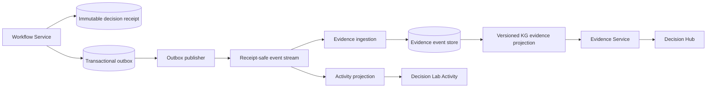

# Historical Evidence Feedback Loop

## Status

**First vertical slice implemented.** The repository now has a receipt-safe
SQLite outbox, an independent Evidence Service ingestion endpoint, and an
asynchronous HTTP publisher. The initial projections are intentionally narrow;
compaction, settlement reconciliation, and production transport remain future
work.

- `workflow_service` persists decision receipts and updates an activity
  projection.
- The Decision Lab renders that projection as its Activity list.
- `Knowledge_graph` builds an offline temporal evidence index from the supplied
  historical dataset.

The Activity database is not the KG source: it is a service-owned,
denormalized UI read model and does not retain all of the stable identifiers
and provenance needed for KG evidence. Both Activity and the Evidence Service
must instead consume receipt-safe events.

## Goal

Create a one-way, asynchronous feedback loop that turns completed decisions
into timestamp-correct historical evidence while keeping authorization latency,
policy authority, and the Activity UI independent of graph processing.



The synchronous decision path is deliberately not in this feedback loop. The
Decision Hub reads a bounded, versioned evidence snapshot from the Evidence
Service; it never waits for a new receipt to be projected.

## Existing Behavior

The first half is already present:

1. `WorkflowState` writes an immutable decision or resolution receipt.
2. It queues an activity update keyed by the receipt hash.
3. `ActivityProjection` stores lifecycle events and one current transaction
   row per authorization.
4. The Decision Lab polls the activity snapshot and renders the transaction
   rows.

The offline KG has the required temporal rule already: evidence queries select
only events whose timestamp is strictly earlier than the candidate transaction.
It distinguishes approved purchases, which can establish familiarity and
spend, from declined attempts, which remain context only.

The missing handoff is visible as a boundary: activity events are inserted into
the Activity service's database only, and the KG build reads its supplied CSV
dataset only. No consumer links the two.

## Source Event Contract

The Workflow Service is the only producer. When it commits a receipt, it must
insert an outbox row in the **same database transaction**. This removes the
failure mode where a receipt exists but its historical evidence is never
published.

Use one immutable message per receipt, named `decision.receipt-recorded.v1`.
The message is receipt-safe: it contains stable references and decision facts,
but no free-text basket or customer instruction content.

```json
{
  "event_id": "receipt_hash",
  "event_type": "decision.receipt-recorded.v1",
  "occurred_at": "2026-09-19T12:03:04.567Z",
  "authorization": {
    "authorization_id": "...",
    "card_id": "...",
    "customer_id": "...",
    "merchant_id": "...",
    "merchant_category": "...",
    "merchant_country": "...",
    "device_id": "...",
    "channel": "...",
    "billing_amount_minor": 12000,
    "currency": "CHF",
    "requested_at": "2026-09-19T12:03:00Z"
  },
  "outcome": {
    "phase": "agent_decision",
    "decision": "approve",
    "effective_at": "2026-09-19T12:03:04.567Z",
    "is_terminal": true,
    "spend_eligibility": "authorization_approved"
  },
  "provenance": {
    "receipt_hash": "...",
    "policy_version": "...",
    "evidence_refs": ["..."],
    "engine_version": "..."
  }
}
```

`event_id` is the receipt hash and is immutable. A customer resolution creates
a second receipt and therefore a second event. The evidence consumer uses the
receipt hash as its idempotency key, not the authorization ID, because a
step-up has both an initial decision and a later final resolution.

### Eligibility Rules

| Receipt condition | Add to recent attempts | Add to familiarity/spend evidence |
| --- | ---: | ---: |
| Proposal only | No | No |
| Initial approve | Yes | `authorization_approved` only |
| Initial decline | Yes | No |
| Initial step-up | Yes | No |
| Customer approves step-up | Yes | `authorization_approved` only |
| Customer declines step-up | Yes | No |
| Settled purchase or refund, when available | Yes | Yes, according to settlement type |

`authorization_approved` is intentionally separate from settled spending.
Until a capture/settlement feed exists, it may be used for the current
prototype's approved-authorization familiarity logic, but it must not be
presented as final settled spend. A future settlement event supersedes that
eligibility with `settled_purchase` or `settled_refund`.

## Projection Design

### Workflow Outbox

Add an `outbox_events` table owned by the Workflow Service:

| Column | Purpose |
| --- | --- |
| `event_id` | Receipt hash; primary key and consumer deduplication key |
| `event_type`, `schema_version` | Explicit evolution contract |
| `payload_json` | Validated receipt-safe event |
| `occurred_at` | Receipt commit time |
| `published_at`, `attempts`, `last_error` | Reliable asynchronous delivery |

The publisher reads unpublished rows in commit order, sends them to the event
stream, and records completion. At-least-once delivery is acceptable because
all consumers deduplicate by `event_id`.

For the first implementation, the event stream may be a small authenticated
HTTP ingestion endpoint with retry and a persistent outbox cursor. A broker is
only needed when throughput or consumer fan-out requires it; the contract stays
the same.

### Activity Projection

The Activity service consumes the same event rather than being called directly
from the workflow request. It keeps its existing two read models:

- `activity_events`: immutable timeline entries keyed by `event_id`.
- `transactions`: the latest display state keyed by `authorization_id`.

Add `evidence_status`, `evidence_projection_version`, and `evidence_updated_at`
to the display row. The Activity list can then show that a final decision is
recorded even while its historical evidence is still queued. The UI remains a
read-only history; it never controls KG ingestion.

### Evidence Ingestion and KG Projection

The Evidence Service consumes the event independently and owns these records:

| Store | Key | Purpose |
| --- | --- | --- |
| `evidence_events` | `event_id` | Immutable normalized receipt facts and provenance |
| `authorization_outcomes` | `authorization_id`, `phase` | Latest lifecycle interpretation without deleting history |
| `evidence_projection_checkpoints` | projection name | Consumer cursor and watermark |
| `evidence_projection_versions` | version ID | Immutable queryable projection metadata |

The consumer validates the event schema, verifies the receipt signature or
hash-chain when available, appends the event, then updates card-, customer-,
merchant-, device-, category-, and time-window indexes. A projection version
includes its source watermark, calculation version, and `as_of` timestamp.
The Evidence Service's existing `POST /v1/evidence/resolve` contract returns
that version in every bundle.

Do not rebuild the entire offline source graph for every event. Keep the source
graph and catalogue snapshots versioned on the batch path, while maintaining
the temporal event index incrementally. A scheduled build can compact and
validate the index, publish a new base snapshot, and retain the event log for
replay.

## Temporal and Consistency Rules

1. For an authorization at $t$, evidence queries may use only records with
   `effective_at < t`. Equal timestamps and future events are excluded.
2. A decision never becomes evidence for itself, even if its event reaches the
   projection before the HTTP response returns.
3. The returned evidence bundle contains `projection_version`, `watermark`,
   `calculation_version`, and each supporting receipt hash.
4. A late event is inserted at its effective time and triggers reindexing of
   affected windows. It never silently rewrites an already issued receipt.
5. Missing, invalid, or stale required evidence produces `step_up` according
   to the configured policy; it can never manufacture an approval.
6. Policy hard declines remain final. KG evidence only adds provenance or a
   conservative step-up recommendation.

The consumer may be eventually consistent. The online resolver must surface
freshness rather than pretending the projection is current, for example:

```json
{
  "version": "evidence-v2.18",
  "watermark": "2026-09-19T12:03:04.567Z",
  "freshness": "within_slo",
  "evidence_refs": [{"receipt_hash": "..."}]
}
```

## Backfill and Replay

Historical data should enter through the same normalized contract, not by
copying rows from the Activity database into KG tables.

1. Export immutable historical receipts, with synthetic provenance for the
   original benchmark files where receipts do not exist.
2. Validate and publish them in deterministic order:
   `effective_at`, then `authorization_id`, then `event_id`.
3. Rebuild a new evidence projection version from that log.
4. Run the existing historical replay suite against the new version and compare
   evidence references, temporal cutoffs, and decisions.
5. Atomically move the resolver's read alias to the validated projection.

This allows a failed or changed build to be discarded without corrupting the
live projection and makes exact historical evidence reproducible.

## Delivery Plan

1. Define `decision.receipt-recorded.v1` as JSON Schema and add contract tests
   for direct decisions, step-up, resolution, retry, and malformed payloads.
2. Move receipt and outbox persistence behind the Workflow Service database
   transaction; add a retrying publisher.
3. Convert ActivityProjection into an idempotent consumer of that event while
   preserving the current Activity API response.
4. Add Evidence Service ingestion, immutable evidence events, and a
   card/customer temporal index that implements the strict cutoff rule.
5. Extend evidence responses and activity rows with projection version and
   freshness state.
6. Backfill from the benchmark history, run replay/audit comparisons, then
   enable the live resolver behind a feature flag.

## Acceptance Checks

- Publishing the same receipt event any number of times creates one evidence
  event and one activity timeline event.
- A transaction at $t$ never observes its own or later decision outcome.
- A step-up followed by a customer approval produces attempt context and one
  eligibility transition without double-counting spend.
- A decline is visible in the Activity list and evidence context but never
  increases familiarity or approved spend.
- A failed evidence consumer does not delay decision recording; its outbox row
  retries and appears as stale or queued in Activity.
- Every evidence bundle identifies a projection version, watermark, calculation
  version, and supporting receipt hashes.
- Rebuilding from the event log produces deterministic temporal evidence and
  retains the existing historical replay guarantees.