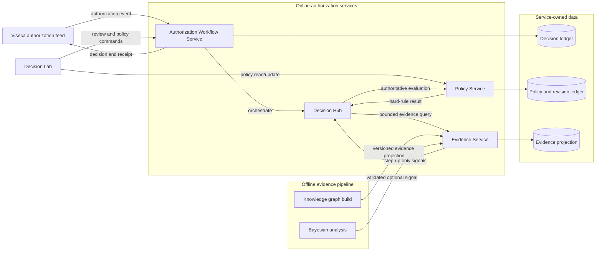

# Consolidated microservice architecture

## Decision

Operate the online authorization path as three independently deployable services.
The Decision Lab is a client application, and the Viseca/mock code is an adapter
used to connect an external authorization feed to the online services. The
knowledge graph and Bayesian network remain offline evidence producers until
an online evidence contract is implemented and validated.

## Service boundaries

| Service | Owns | Does not own |
| --- | --- | --- |
| Authorization Workflow Service | Authorization intake, idempotency, deadline handling, orchestration, decision receipts, customer step-up state, and outbound decision submission | Policy definitions, rule implementation, raw historical data, or analytics dashboards |
| Policy Service | Customer policy documents, revision ledger, deterministic rule evaluation, and policy-derived reason codes | Authorization workflow state, external callbacks, activity projections, or UI sessions |
| Evidence Service | Read-only, versioned, bounded evidence bundles and freshness/provenance metadata | Policy mutation, final decisions, customer instructions, or raw graph-building jobs |

## Central Decision Hub

The Decision Hub is the synchronous inference engine inside the Authorization
Workflow Service. It provides one extension contract for connected subsystems:
`name`, `required`, and `assess(event)`. Every assessment returns a version,
availability status, evidence references, reason codes, and at most a
`step_up` recommendation.

Policy is always evaluated first and remains authoritative. A hard policy
decline is final. Other subsystems, including Knowledge Graph and Bayesian
adapters, can add provenance or escalate a non-decline to `step_up`; they
cannot produce or restore an approval. This gives new services one stable
integration point without coupling them to the workflow, receipt, or policy
datastores.

Each service has one private datastore. No service reads another service's
tables or SQLite files. All cross-service interaction uses authenticated,
versioned HTTP APIs. A shared event bus is optional and is only introduced for
asynchronous projections and analytics; it is not part of the synchronous
authorization decision path.

## Online decision flow

1. The Authorization Workflow Service receives an authorization event with an
   idempotency key and decision deadline.
2. The Decision Hub evaluates the event through the Policy subsystem.
3. The Hub invokes each configured advisory subsystem with the normalized
   event and collects versioned evidence bundles.
4. The Policy Service returns deterministic hard-rule results, and the Hub may
   only add a fail-safe `step_up` based on advisory evidence.
5. The Workflow Service applies workflow-only controls: expired deadline,
   duplicate request, unavailable dependency, and required customer step-up.
6. The Workflow Service persists an immutable decision receipt before sending
   the final decision to Viseca. It emits a redacted event for analytics after
   the receipt is durable.

A hard-policy violation always results in `decline`; evidence or model output
cannot relax it. Missing, stale, or insufficient evidence must fail closed to
`step_up` or `decline` according to the policy, never to `approve`.

## API contracts

Keep the public contracts small and explicit.

| Caller | Endpoint | Purpose |
| --- | --- | --- |
| Viseca adapter | `POST /v1/authorizations` | Submit one normalized authorization event with `Idempotency-Key` and deadline |
| Workflow Service | `POST /v1/evidence/resolve` | Retrieve the bounded evidence bundle, source versions, and freshness state |
| Workflow Service | `POST /v1/policy/evaluations` | Evaluate one event against a policy revision and evidence bundle |
| Decision Lab | `GET /v1/authorizations/{id}` | Read the receipt-safe authorization status |
| Decision Lab | `POST /v1/authorizations/{id}/resolution` | Record a customer-confirmed step-up resolution |
| Decision Lab | `GET/PATCH /v1/policies/{policyId}` | Read and update a versioned customer policy using `If-Match` |

The Policy Service must return a deterministic response for the same event,
policy revision, and evidence bundle. The Workflow Service is the only service
that may submit the final decision to an external authorization API.

## Current code mapped to the target

| Current component | Target responsibility | Required change |
| --- | --- | --- |
| `rule_service` | Policy Service | Retain the policy store, revision ledger, and pure evaluation code. Rename endpoints under `/v1/policy`; remove run/demo orchestration from the service. |
| `mock_api/viseca_mock.py` | Viseca adapter, then Workflow Service | Split HTTP feed simulation from workflow state, receipts, activity projection, and decision submission. Keep the mock only in local/test deployments. |
| `mock_api/mock_api.py` | Local adapter test fixture | Keep as a contract-test client of the three services; do not promote it to production orchestration. |
| `mock_api/decision_receipts.py` | Workflow Service datastore | Move receipt writing and resolution state behind the Workflow Service API. |
| `mock_api/activity_projection.py` and `observability.py` | Asynchronous analytics projection | Consume redacted `decision.recorded` events; never delay the decision path. |
| `Knowledge_graph` | Evidence pipeline | Publish a versioned, read-only evidence projection instead of importing graph code into the Policy Service. |
| `Bayesian network` | Optional evidence signal producer | Publish calibrated, versioned signals only after validation; it can cause step-up but cannot override hard policy rules. |
| `live_layer/decision-lab` | Client application | Call Workflow and Policy APIs through a gateway/BFF; it must not access service databases or decide authorizations. |

## Implemented first slice

`workflow_service/` now owns the extracted lifecycle core and an authenticated
loopback HTTP API. `mock_api/viseca_mock.py` can run as a thin adapter to that
service when `WORKFLOW_SERVICE_URL` is configured; otherwise it uses the same
extracted core in process for backwards-compatible demos. The standalone
service and the remote-adapter path have focused contract tests.

## Deployment topology

Deploy the Workflow Service, Policy Service, and Evidence Service separately.
Place an API gateway in front of browser-facing APIs and keep internal service
APIs on a private network with service-to-service authentication. The Viseca
adapter can run beside the Workflow Service but remains a separate deployment
so protocol changes do not affect decision logic.

Use one database per service. Start with relational storage for the Workflow
and Policy services and a materialized read model for Evidence. Do not add a
graph database or message broker until the evidence projection volume or
asynchronous fan-out requires one.

## Migration sequence

1. Extract the Workflow Service from `mock_api/viseca_mock.py`, preserving the
   existing rule-service client call and receipt semantics.
2. Move receipt and customer-resolution persistence into the Workflow Service;
   make activity projection consume emitted receipt-safe events.
3. Simplify `rule_service` to policy CRUD and deterministic evaluation only.
4. Introduce the Evidence Service with a static, versioned projection generated
   by `Knowledge_graph`; replace the Policy Service's direct Python import of
   graph code.
5. Put the Decision Lab behind the API gateway and point it only at Workflow
   and Policy endpoints.
6. Add the Bayesian signal to the Evidence Service only after calibration,
   latency, and fail-safe tests pass.

## Operational invariants

- Every final decision is idempotent and has one immutable receipt.
- Every receipt records policy revision, evidence version, evaluation version,
  dependency status, and reason codes.
- The synchronous path has a bounded deadline and no asynchronous dependency.
- Services degrade safely: unavailable policy or evidence dependencies cannot
  produce an approval.
- Raw customer and transaction data stays out of telemetry events.
- Policy updates use optimistic concurrency and become effective only after a
  successful revision write.
